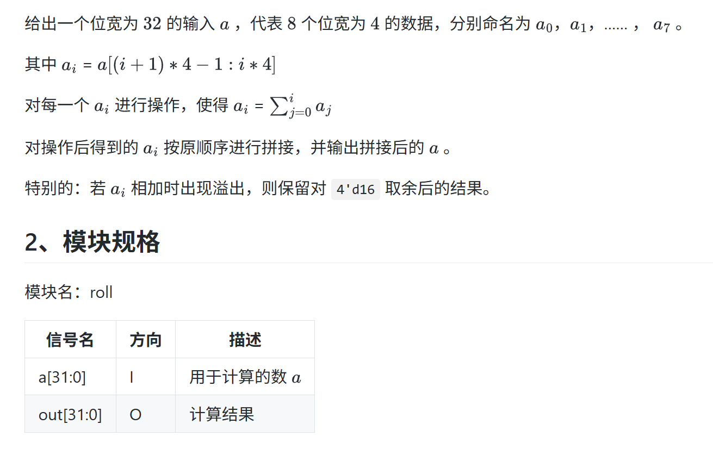

CO的第一次上机，寄。。。
## Logisim
### 题目

第一题卡了一个多小时，原因是最后的flag输出要在下一个周期才置1，需要增加一个寄存器
- **对于时钟周期的理解**还不到位
  - 
  - 
  - 当前周期是进行输入，当下一个上升沿到来时才是**下一个周期**
- 然后还有就是电路图绘制的不够优雅，需要养成**良好的工程风格**

### 状态机分析
这道题就是一个典型的状态机问题，状态机的核心要素就是：

- **存储状态**用的寄存器，把Q端的输出认为是当前周期所在的状态
- **状态转移**，对Q端的输出进行状态转移得到新的状态，**但要注意这个新状态是下一个周期的预备状态**，需要进行判断之后才能进行更新
- 状态的**输出**，即根据当前周期的状态和当前周期的输入（是否根据输入要看状态机的类型，如果输出只和状态有关就是Moore型状态机，如果和输入以及状态都有关就是Meely型状态机）来进行相应的输出

好下面我们来对题目进行具体的分析：

#### 状态存储与状态转移
首先就是对状态进行存储，这里x和y的范围是0-5，所以我们用两个寄存器，每个寄存器有3位来存储状态

然后进行状态转移，Q端是当前周期的状态，我们加上dx和dy之后就是下一个周期的预备状态

#### 判定不合法
得到了预备状态我们自然要对这个进行判断是否合法，即(x,y)是(1,2)等墙的话就不合法，以及x和y大于了5也是不合法，**为了工程的优雅性**我们在这里加上子模块来判断不合法。

因为不合法的情况共有8种，然后我们是对x和y都要进行判断，所以这里x和y需要用到的地方就很多，为了画图的美观性我们就把x和y拉成“挂面”，方便后续的取用，类似于地址总线的意思。

在判断的时候我们会用到比较器，比较器一定要注意比较的类型，是进行unsigned类型的比较还是补码类型的比较
>这里就有一个比较坑的地方是如果把constant设置为了3位的数字，那么如果比较器是进行的补码比较就会把5视为一个负数，从而导致判定出现问题，所以我们这里采用unsigned比较

#### 根据是否合法来判定下一个周期的状态
这里我们就可以把判定不合法模块的的输出作为多路选择器的选择端口，如果为1说明不合法，保持原状态，如果合法，下个周期就更新为新的状态
>多用tunnel，这样就不会有很多线交在一起了

#### out的输出
由题目的描述可以知道，只要当前状态位于(5，5)，out就是1，说明out的输出与输入无关，是Moore状态机，我们就加一个判定是否是终点的模块

#### Flag的输出
就是栽在这里了。。。

题目描述说的是如果预期位置为0，则在下一个周期把flag置为1，也就是说，**不能判定完不合法就立刻把flag置为1**，需要增加一个**寄存器**，让下一个时钟上升沿到来时才把flag设置为1

#### 最终结果

~~重做一遍的时候忘记dx和dy是1位输入要用bit extender扩展为3位置了。。。~~
## Verilog
忘记语法了。。。

ISE语言模板在edit->language templates

后面看一下语言模板

### 题目

看了之后有点气笑了

直接把a0，a1...a7全部取出来，然后累加一下就行了，不过需要注意的是评测机的版本比较老，似乎**不支持用integer作为索引，必须使用常量**。。。

>还有就是其实不需要管题目所说的对16取模，因为溢出了之后相当于直接取了后四位也就自动取模了

所以也就没法用循环了，直接取出来然后加上就可
### 代码

## MIPS汇编
汇编写的不够优雅，指令不熟悉

比较不熟悉的地方是内存的各种操作

### 题目

### 代码
易错的地方：
- 用i和j去算index的时候**不要改变i和j本身的值**（还要用于后续的循环）,要养成**函数传参的时候不改变原始的值**的好习惯
  - 

