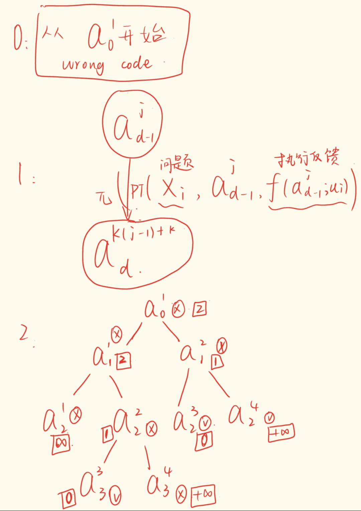
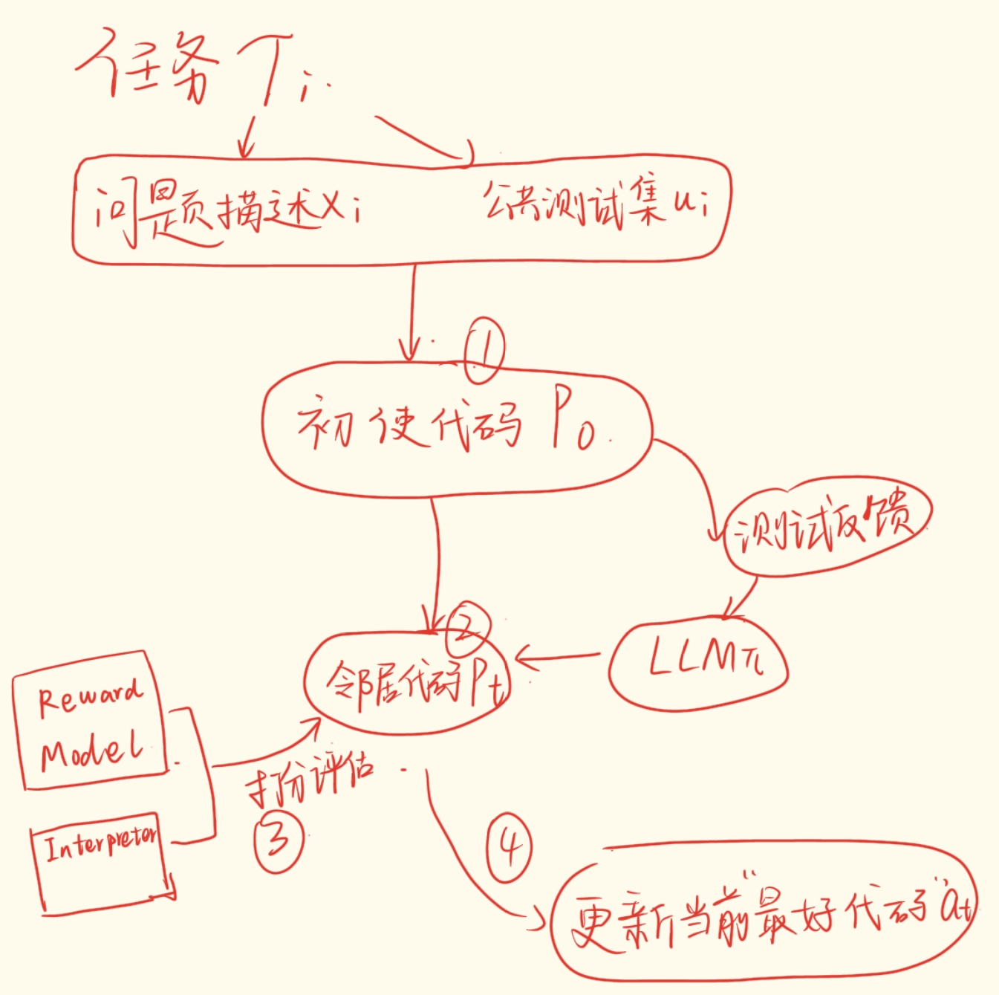

## Let’s Revise Step-by-Step: A Unified Local Search Framework for Code Generation with LLMs

### 核心方法

### 核心组件
#### initial code drafting
#### neighborhood code generation
#### candidate evaluation
#### incumbent code updating

#### Revision Reward Model Training

