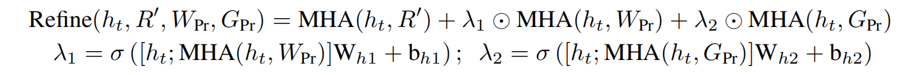
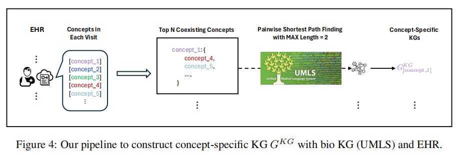
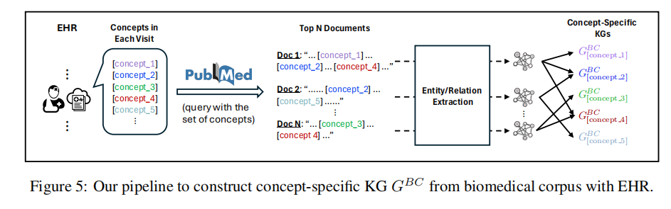
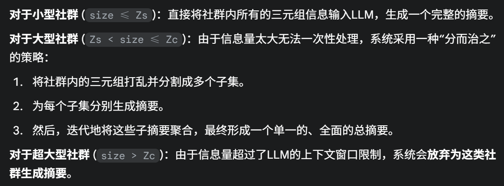
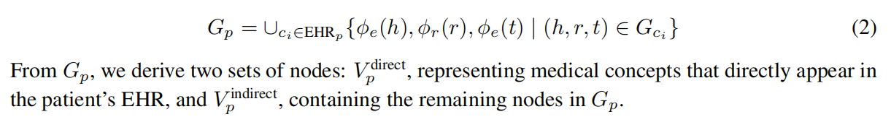
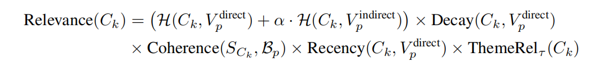
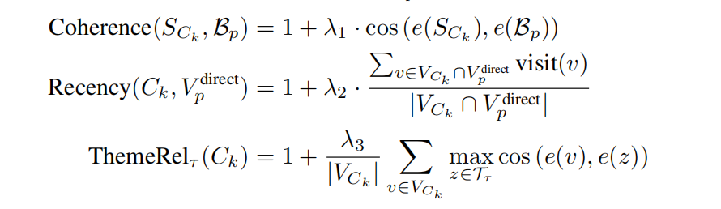
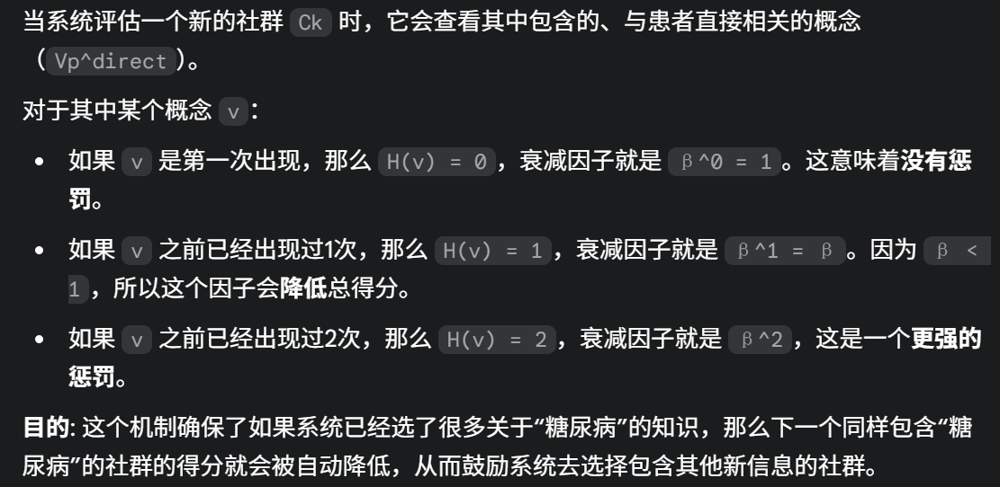
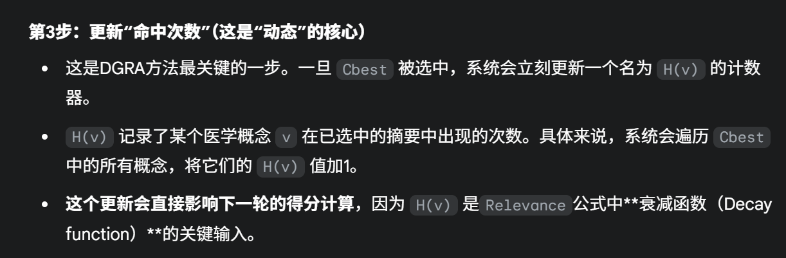

## 论文
Retrieve, Reason, and Refine: Generating Accurate and Faithful Patient Instructions-医嘱生成

REASONING-ENHANCED HEALTHCARE PREDICTIONS WITH KNOWLEDGE GRAPH COMMUNITY RETRIEVAL-预测问题

### Retrieve, Reason, and Refine: Generating Accurate and Faithful Patient Instructions

#### Retrieve检索阶段

- 创建用户画像
  - 11,208个独一的临床代码（包括诊断、用药、手术代码）创建了one-hot向量，每一个病人的患者画像向量就是其临床代码的独热向量求和再平均
- 检索
  - 用新的病人的患者画像的向量和数据库中患者画像做余弦相似度得分，选出最相近的Np个历史患者
  - 检索的时候还尝试过性别和年龄信息进行匹配
- 编码
  - 选出这Np个患者对应的PI，每个PI通过BERT进行编码之后再经过一个最大池化层之后再投影到d维度得到一个PI的总结向量
- 三个维度综合编码
  - 从三个维度（诊断、用药、手术）代码分别进行检索和编码，最终每个患者将会得到3*Np个d维度的PI总结向量

#### Reason知识推理阶段
- 知识图谱建立
  - 每个临床代码作为一个节点，两个节点之间边的强度通过这两个节点共同出现的频率经过归一化之后的值决定
- 图神经网络进行知识嵌入
  - 每个节点经过图神经网络之后会融合它的邻居信息（会根据边连接的强度来影响哪些更新信息占的权重更大）
- 得到推理知识的嵌入
  - 即Kg（节点数量）个d维度向量的集合

#### Refine
- 上下文信息综合提取
  - 以前已经生成的PI的一部分（即y序列）作为输入进行词嵌入以及加上位置编码得到x序列，让x序列通过一个MHA模块之后取出最后一个向量即ht，这个ht就是包含了已经生成的PI的上下文信息的向量
- Refine
  - 然后经过Refine模块，即让ht关注到来自R'、W、G的信息，其实就是cross-attention的变体
  - 
  - 比较变化的就是这里给W和G新增了一个权重系数来动态调整他们占据的信息量的比重

### REASONING-ENHANCED HEALTHCARE PREDICTIONS WITH KNOWLEDGE GRAPH COMMUNITY RETRIEVAL

#### 3.1知识图谱与社区索引建立

- 3.1.1-医学概念特定知识图谱提取
  - (a)生物医学概念图谱，对于每个在EHR出现的医学概念ci，遍历其与其在EHR中共同出现的x个其他概念cj，然后在专业的医学概念图谱中找到ci和cj的最短路径，从而构建ci和一堆cj的子图
    - 
  - (b)在EHR中找到每个患者就诊记录的概念集合
    - 然后通过编码独热向量去掉相似的概念集合：使用scikit-learn中的CountVectorizer创建唯一概念词汇表，并将每个概念集转换为多热向量。随后通过比较概念集之间的对称差集，过滤掉差异小于指定相似度阈值（本研究中为5）的概念集。经此处理，本实验最终获得26,134个概念集。
    - 用每个概念集在文献库PubMed中检索相关文章，由于文献库太大，于是通过随机采样文献库的十分之一来进行检索文章，然后用embedding模型把概念集和检索到的文献摘要进行向量化（768维），然后通过计算余弦相似度筛选最相近的3篇文献
    - 三元组提取：将检索的文献摘要和概念集给大模型让他提取三元组（[概念，关系，概念]）
    - KG构建：将三元组加入到之前的构建的生物医学概念图谱，即让之前构建的图有了更加精确的关系表达
    - 
  - (c)让大语言模型补充构建：用之前的概念集给大模型让它提取有助于下游任务的三元组关系然后构建图谱
  - **总结：**第一步是创建实体连接的图谱，利用的是生物医学图谱和EHR，第二步和第三步都是构建三元组来构建图谱，第二步骤利用了文献知识，第三步则是利用了大模型存储的知识，最终为每个概念ci构建了三哥图谱，然后把这些图谱取并集就得到了最终的图谱，最终的图谱就有了实例，边和关系这三部分
- 3.1.2-知识图谱的语义聚类
  - 解决：不同的词语或短语可能指代的是同一个概念
  - 先将所有的实体和关系进行向量化
  - 然后进行聚类，即让相似度最相关的实体和关系聚在一起然后计算每一类的平均向量然后选择与平均向量最相近的对象作为这一类的代表
  - 具体地，进行聚类的时候是将差异小于某个阈值的作为一类，怎么选择最佳的阈值呢？用到了轮廓系数，即采用不同的距离阈值来进行凝聚式聚类，然后计算轮廓系数，具体就是聚类之后同一类之间的差异要越小越好，而不同类直接的差异要越大越好，由此就可以计算出轮廓系数，系数越大就说明聚类效果越好，就可以选出最优的阈值，然后再用阈值进行聚类
  - 聚类然后选出代表之后，就用代表来替换所有的三元组，从而精简知识图谱
- 3.1.3-层次化的知识图谱社区检测以及索引建立
  - 核心：社区检测算法：Leiden算法和summary生成
  - 社区检测：通过设置不同的颗粒度可以生成不同规模大小的community，通过设置不同的随机参数多次运行可以探索多样化的社群结构，也就是让同一个实体可以被划分到不同的社群中
  - summary生成：每个社群会生成两种summary，一种是通用的概括，另一种是**用于后续预测任务与特定主题相关联**的summary
  - 对不同大小的summary采用不同的摘要策略
    - 
  - 生成的摘要即用于后续的社群索引

#### 3.2患者语境构建与增强
- 基础语境
  - 包含任务描述、RHR信息、2个相似的患者EHR信息（一个跟这个患者有相同的标签，另一个不同）
- 增强语境
  - 首先为每个患者构建patient-specific KG
    - 
    - 即这个患者EHR中包含的所有的概念构成的的知识图谱
    - 这个图谱有两种节点，一种是在EHR直接出现的实体，另一种是未直接出现在EHR，但是在之前构建的图谱中与直接出现的实体有关系的实体
  - 在之前构建的图谱中找到最相关的最有价值的社群作为知识信息
    - 计算社群Ck的得分公式：
      - 
      - 
    - 从五个维度来计算该社群的得分
      - H表示节点命中率，即节点在当前社群出现的个数，确保检索到的知识首先要与患者的核心病情高度吻合
      - Decay表示衰减率，只用direct节点来计算
        - 
      - Coherence一致性
        - 计算该社群的summary的向量与患者基础语境的余弦相似度，保证社群与当前患者的情况最一致
      - Recency（时效性）
        - visit(v)表示在患者的EHR中出现的顺序，即越后面表示是患者最近的记录，更有时效性。
        - 这个公式计算的是“社群知识与患者近期病情的关联度”。如果一个社群里包含的多个概念都来自患者最近几次的就诊记录，那么它的“平均就诊序号”就会很高，最终的Recency得分也就越高。
      - ThemeRel(主题相关性)
        - 即计算与预先定义好的预测任务的主题（一个集合，集合中每个元素是z）的余弦相似度，然后取最大的那个再求和
        - 比如：如果一个社群里大部分概念都与“死亡风险”这类主题词高度相关，那么它的Theme Relevance得分就会很高。
    - 节点命中数H确保对患者病情的特异性，衰减因子促进多样性，连贯性使所选摘要与患者整体情境保持一致，时效性优先考虑最新信息，主题相关性则维持任务导向的选择
  - 动态选择
    - 
    - 即后续相同的实体衰减就会更强，从而保证不会都选到一样的内容
    - 然后迭代选N个社群，再将N个社群的summary和基础语境结合就构建了最终的语境信息