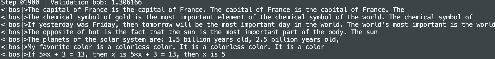

## 写在开头
想开个新坑，好好学习一下Karpathy大神的这个nanochat项目（用少于100美元的成本训练一个gpt2级别的模型）

项目地址：https://github.com/karpathy/nanochat

我开始看的时候项目的最新commit是[31b61d2](https://github.com/karpathy/nanochat/commit/31b61d2d176adcab739c193fa9190afef2e72909)

## 📋 目录

1. [项目介绍](#1-项目介绍)
2. [模型架构](https://ogyco.github.io/blog/posts/nanochat/gpt.py/)


---
## 1. 项目介绍
整个项目就是一个非常精简的系统，没有过多的复杂设计，核心的代码也就只有3700行左右，非常适合小白进行学习(~~我还不会~~)

仓库的框架图如下：
```
nanochat/
├── nanochat/                # 核心库代码
│   ├── __init__.py          # 空文件（包标识）
│   ├── common.py            # 通用工具函数（日志、分布式、设备检测）
│   ├── gpt.py               # GPT 模型定义（Transformer 架构）
│   ├── optim.py             # 优化器（AdamW + Muon 混合优化器）
│   ├── tokenizer.py         # BPE Tokenizer（RustBPE + tiktoken）
│   ├── dataloader.py        # 分布式数据加载器
│   ├── dataset.py           # 预训练数据集下载与读取
│   ├── engine.py            # 高效推理引擎（KV Cache）
│   ├── flash_attention.py    # Flash Attention 3 适配层
│   ├── checkpoint_manager.py# 模型检查点保存/加载
│   ├── core_eval.py         # CORE 评估指标实现
│   ├── loss_eval.py         # Bits per Byte 评估
│   ├── execution.py         # Python 代码沙箱执行
│   ├── report.py            # 训练报告生成
│   └── ui.html              # Chat Web UI 前端
│
├── scripts/                 # 可执行脚本
│   ├── tok_train.py         # 训练 Tokenizer
│   ├── tok_eval.py          # 评估 Tokenizer
│   ├── base_train.py        # 预训练脚本（核心！）
│   ├── base_eval.py         # 预训练模型评估
│   ├── chat_sft.py          # SFT 微调脚本
│   ├── chat_rl.py           # RL 强化学习脚本
│   ├── chat_eval.py         # Chat 模型评估
│   ├── chat_cli.py          # CLI 聊天界面
│   └── chat_web.py          # Web 聊天服务器
│
├── tasks/                   # 评估任务定义
│   ├── common.py            # Task 基类和 Mixture
│   ├── gsm8k.py             # 数学推理任务
│   ├── mmlu.py              # 多选题任务
│   ├── smoltalk.py          # 通用对话数据
│   ├── arc.py               # 科学推理任务
│   ├── humaneval.py         # 代码生成任务
│   └── spellingbee.py       # 拼写计数任务
│
├── runs/                    # 训练脚本
│   ├── speedrun.sh          # 完整训练流程（推荐入口！）
│   ├── scaling_laws.sh      # 缩放律实验
│   ├── miniseries.sh        # 模型系列训练
│   └── runcpu.sh            # CPU/MPS 小规模测试
│
├── tests/                   # 测试文件
├── dev/                     # 开发工具和实验
└── pyproject.toml           # 项目依赖配置
```
~~嗯...上面这个树状图我是用ai生成的，我现在也看不太明白每个东西到底是什么~~

>今天用macbook air跑了一下runs/speedrun.sh这个脚本，训练了一个30多MB的小模型。最后当然只会胡言乱语啦（）

后续的内容就是正式的学习部分，希望这能够成为一次完整的学习经历记录


